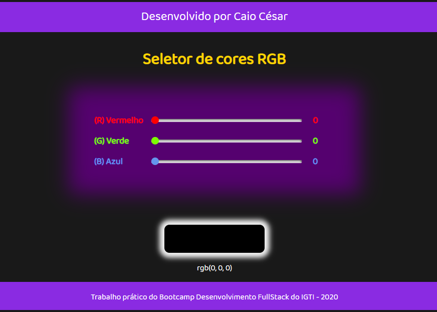

# IGTI-FSDev-seletor-de-cores-RGB

Repositório dos meus aprendizados no Bootcamp de Desenvolvedor FullStack da IGTI.

Este é o resultado de como ficou o meu Seletor de cores RGB.

Este é o primeiro projeto realizado por mim nos estudos do Bootcamp de Desenvolvimento Fullstack da IGTI.
O principal conteúdo avaliado foi a manipulação de elementos do DOM com javascript.
