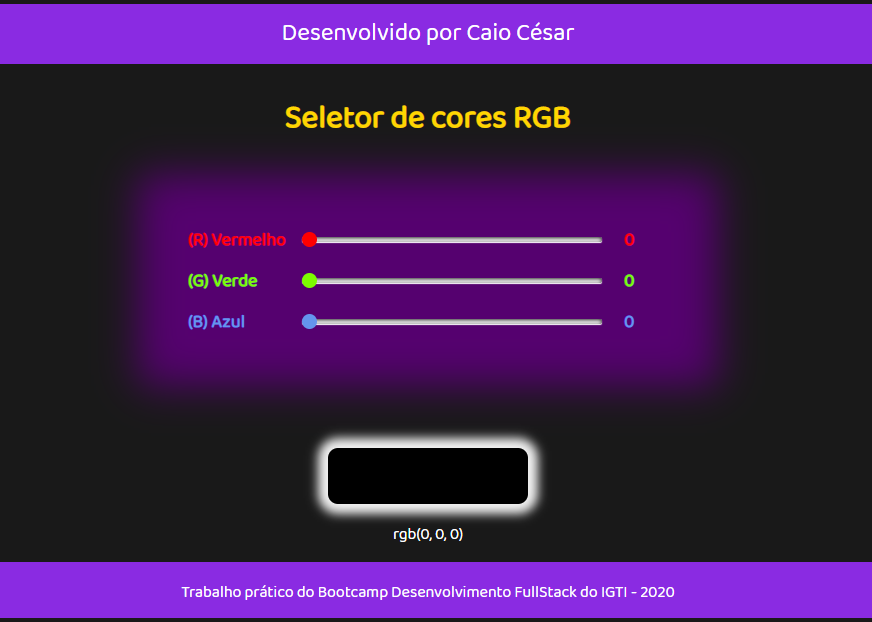

<h1 align="center">Seletor de Cores RGB</h1>

Repositório dos meus aprendizados no Bootcamp de Desenvolvedor FullStack da IGTI.

<h2 align="left">Sobre o desafio:</h1>

Este é o primeiro projeto realizado por mim nos estudos do Bootcamp de Desenvolvimento Fullstack da IGTI.
O principal conteúdo avaliado foi a manipulação de elementos do DOM com javascript.

Este é o resultado de como ficou o meu Seletor de cores RGB:

<h1 align="center">

</h1>

<h2 align="left">No módulo deste desafio aprendi os seguintes conceitos:</h2>

<!--ts-->

- [Utilização de elementos HTML](#Utilizacao-de-elementos-HTML)
- [Utilização de CSS](#Utilizacao-de-CSS)
- [Utilização de identificadores em elementos HTML](#Utilizacao-de-identificadores-em-elementos-HTML)
- [Captura de referência de elementos com JavaScript](#Captura-de-referencia-de-elementos-com-JavaScript)
- [Manipulação de eventos com JavaScript](#Manipulacao-de-eventos-com-JavaScript)
- [Utilização de funções com JavaScript e CSS](#Utilizacao-de-funcoes-com-JavaScript-e-CSS)
- [Manipulação direta de CSS com JavaScript](#Manipulacao-direta-de-CSS-com-JavaScript)
<!--te-->

<h2 align="left">O desafio:</h2>

<ol type="1">
<li>Implementar, através de HTML, CSS e JavaScript puro, uma aplicação que contenha três inputs do tipo “range”, cujos valores vão de 0 a 255 e representem, respectivamente, R (Red – Vermelho), G (Green – Verde) e B (Blue – Azul)</li>
<li>Essa combinação de valores deve ser utilizada para preencher a cor de fundo de uma div quadrada</li>
<li>Além disso, inclua três inputs de texto somente-leitura (desabilitados) para a visualização do valor atual de cada input do tipo range</li>
<li>À medida em que o usuário modifica o valor dos ranges com as teclas ← e → do teclado, a div deve refletir a cor correspondente</li>
</ol>
