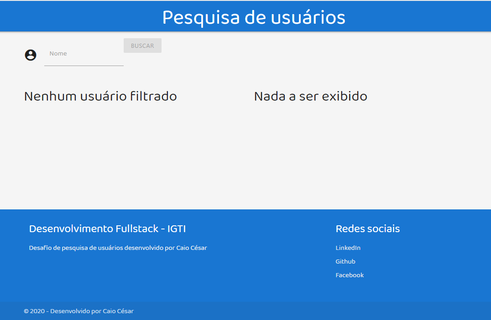
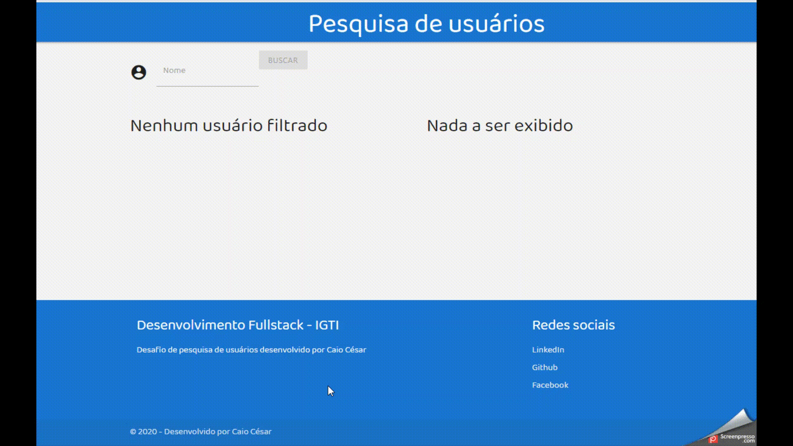

<h1 align="center">Aplicação de pesquisa de usuários</h1>

Repositório dos meus aprendizados no Bootcamp de Desenvolvedor FullStack da IGTI.

<h2 align="left">Sobre o desafio:</h1>

Este é o segundo projeto realizado por mim nos estudos do Bootcamp de Desenvolvimento Fullstack da IGTI.
O principal conteúdo avaliado foi a manipulação de elementos do DOM com javascript, manipulação de API e métodos Array.

Este é o resultado de como ficou a minha aplicação de pesquisa de usuários:

<h1 align="center">

</h1>

<h2 align="left">No módulo deste desafio aprendi os seguintes conceitos:</h2>

<!--ts-->

- [Declarar elementos HTML como títulos, input, div, span, ul, li etc](#Declarar-elementos-HTML-como-titulos-input-div-span-ul-li-etc)
- [Estilizar o app com CSS](#Estilizar-o-app-com-CSS)
- [Mapear elementos do DOM para serem manipulados com JavaScript](#Mapear-elementos-do-DOM-para-serem-manipulados-com-JavaScript)
- [Formatar valores com JavaScript](#Formatar-valores-com-JavaScript)
- [Realizar diversos cálculos com array methods como map, filter e reduce](#Realizar-diversos-calculos-com-array-methods-como-map-filter-e-reduce)
- [Realizar requisições HTTP com o comando fetch](#Realizar-requisicoes-HTTP-com-o-comando-fetch)
<!--te-->

<h2 align="left">O desafio:</h2>

<ol type="1">
<li>Criar uma aplicação para filtrar usuários e mostrar estatísticas a partir do filtro definido</li>
<li>Na carga inicial da aplicação, obter os dados de:
https://randomuser.me/api/?seed=javascript&results=100&nat=BR&noinfo</li>
<li>Carregar os dados dos usuários em um array</li>
<li>Permitir a filtragem de usuários através de um input com interação do usuário</li>
<li>O usuário poderá filtrar dados quando digitar pelo menos um caractere no input</li>
<li>O usuário poderá filtrar os dados tanto digitando "Enter" quanto clicando no botão
correspondente, conforme imagens mais abaixo</li>
<li>Montar dois painéis</li>
<li>No painel da esquerda, listar os usuários filtrados</li>
<li>No painel da direita, calcular e mostrar algumas estatísticas sobre esses usuários</li>
<li>À medida em que o usuário modifica o valor dos ranges com as teclas ← e → do teclado, a div deve refletir a cor correspondente</li>
<li>À medida em que o usuário modifica o valor dos ranges com as teclas ← e → do teclado, a div deve refletir a cor correspondente</li>
</ol>

<h2 align="left">Aplicação concluída:</h2>
<h1 align="center">

</h1>
